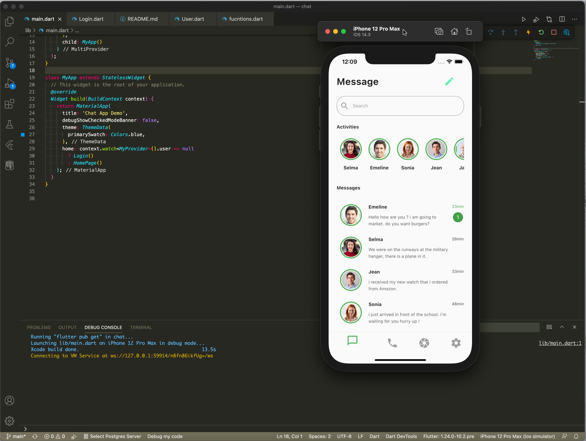

# Chat App UI Design In Flutter

Sample Chat App Design In Flutter
Connect to Api writen in python and deploy to Heroku

Front end: Flutter

Back end : Python

Database : Postgresql

[find me here ](http://zahmatkesh.dev), to hire :sunglasses:,

